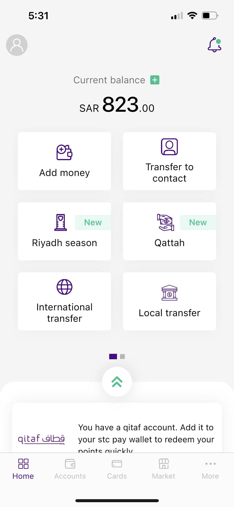
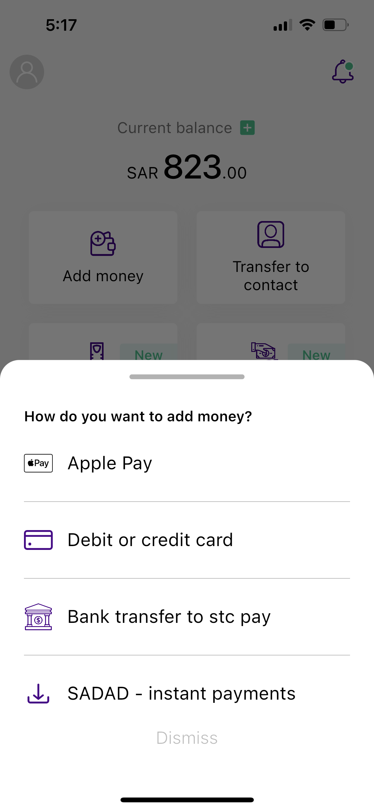
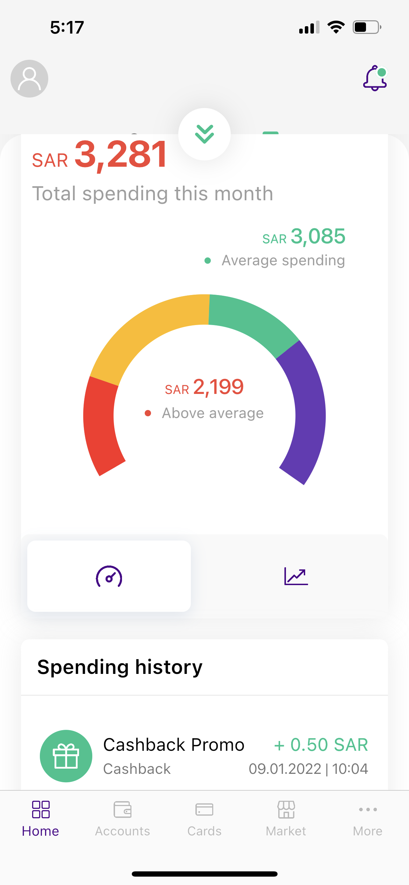
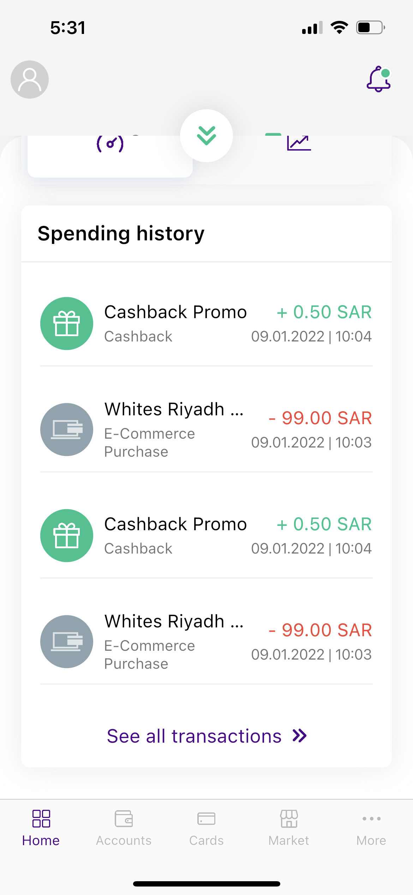

# stcpay UI design

Single home page UI design of very popular <b>FinTech</b> application in KSA known as <b>stc pay</b>.
# Required Flutter with null-safety 2.0 or later
- Clone the repository
 ```sh
  git clone https://github.com/mohammadsaif19/stcpay_ui.git
```
- Run this command in the terminal of project to get the packages from flutter SDK
```sh
  flutter pub get
```
- Finally, enter this cmd line into terminal inside the project to run the application
```sh
  flutter run
```
- <b>That's it and now it's time to show your magic 😉😎</b>

# Screenshots
 



## Getting Started

This project is a starting point for a Flutter application.

A few resources to get you started if this is your first Flutter project:

- [Lab: Write your first Flutter app](https://flutter.dev/docs/get-started/codelab)
- [Cookbook: Useful Flutter samples](https://flutter.dev/docs/cookbook)

For help getting started with Flutter, view our
[online documentation](https://flutter.dev/docs), which offers tutorials,
samples, guidance on mobile development, and a full API reference.
